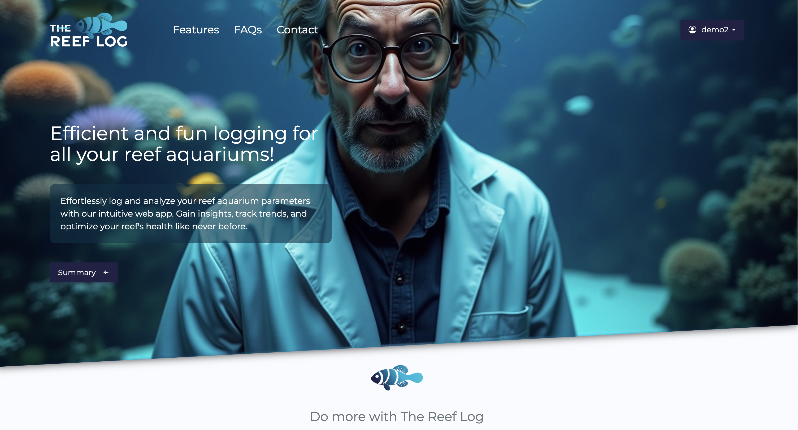
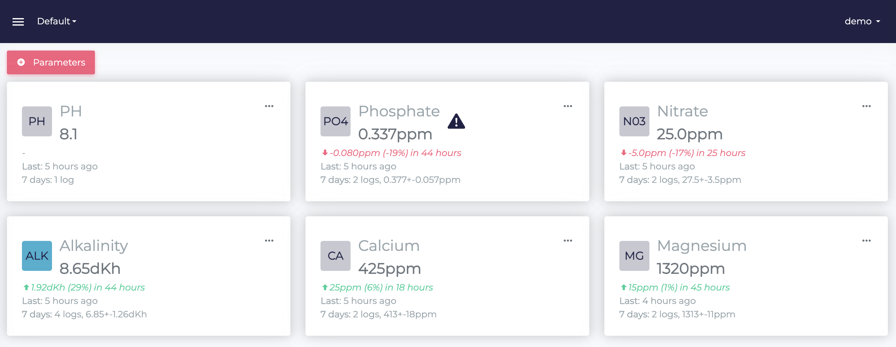
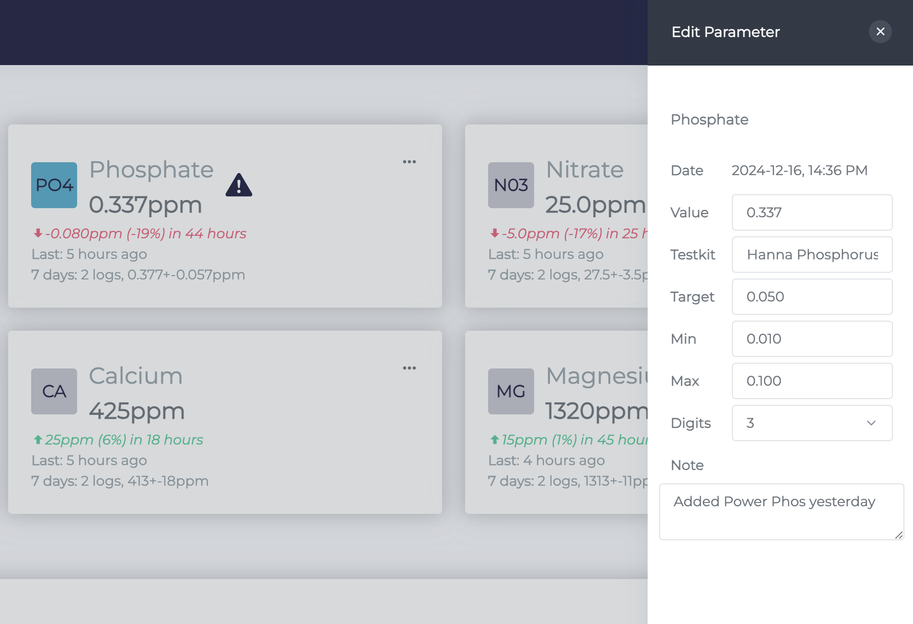
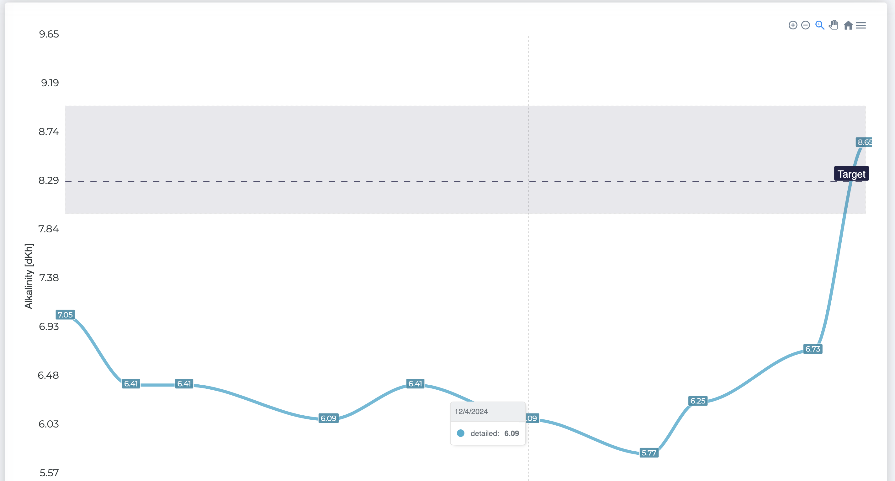
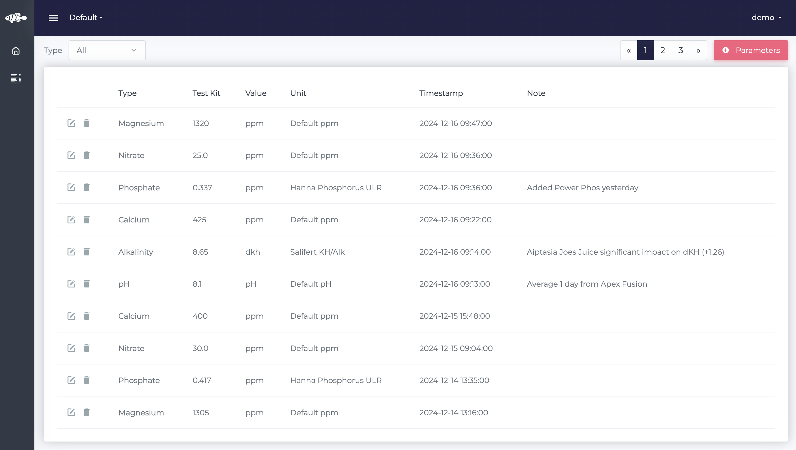
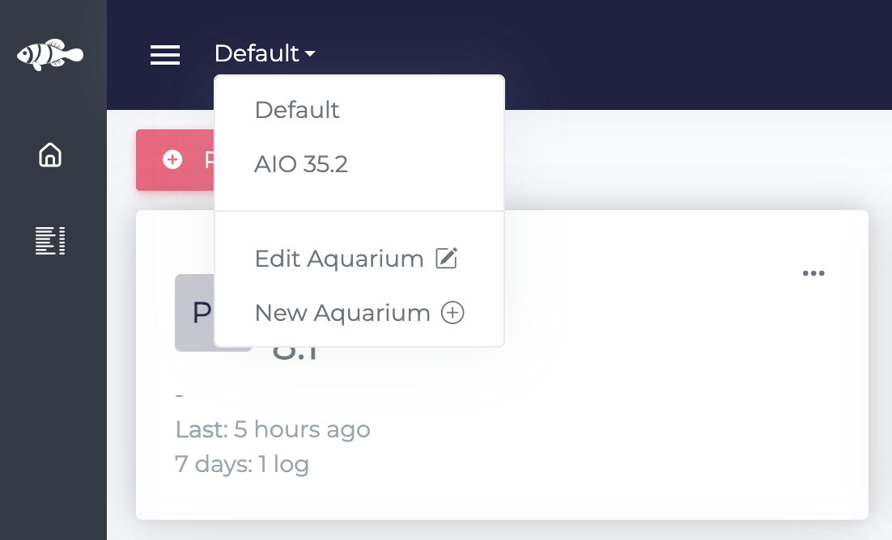

# The Reef Log

I’m thrilled to announce the launch of [_The Reef Log_](https://thereeflog.com), a free website and API designed to help reef aquarium enthusiasts like you log and manage water parameters effortlessly.

Ready to dive in?

- Explore the [Demo](https://thereeflog.com?demo=true)
- Start your journey with the [Free Registeration](https://thereeflog.com/register.html)

## Features

**Comprehensive Overview**

Quickly view key stats, including time since your last log, percentage changes, weekly averages, and more.

**Customizable Parameters**

Set target, minimum, and maximum values for each parameter. Add details like the test kit used for more accuracy.

**Trend Analysis**

Plot trends and compare them against targets or ranges. Visualize data daily, weekly, monthly, or yearly.

Easily take a look at all your parameters, including all your notes.

**Detailed Logs**

View all your parameters in one place, complete with notes for context.

**Multi-Aquarium Management**

Seamlessly manage logs for multiple tanks.

## Why _The Reef Log_ ?

As a reef hobbyist, I’ve tried everything from Excel to paid apps, yet nothing met my needs. Most tools were clunky or lacked essential features, leading me to stop logging parameters altogether—a risky move for any reef keeper.

Here’s what I wanted in a logging tool:

- **Modern Design:** Clean, intuitive, and optimized for both desktop and mobile.
- **Comprehensive Insights:** At-a-glance summaries and detailed trend tracking.
- **Cross-Device Accessibility:** No more app clutter! Just open your browser and go.
- **Data Ownership:** Full control to export your logs whenever you want.
- **Rich Context:** Add notes to each log for better insights.
- **Multi-Aquarium Support:** Manage multiple tanks with ease.
- **Active Development:** Continuous improvements driven by community feedback.
- **Reef-Specific Features:** Predefined parameters and ranges tailored for reef aquariums.

I also wanted to make this project open source. As hobbyists, we collectively gather thousands of data points each week. By aggregating and anonymizing this data, we could contribute to valuable scientific research and help the global reef-keeping community.

## What’s Next?

This is just the beginning! Your feedback will be crucial in shaping _The Reef Log_ into the ultimate reef aquarium management tool.

Thank you for your support, and happy reefing!
